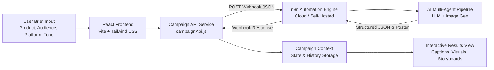

# 🚀 Social AI — AI Social Media Campaign Studio

<div align="center">

[](https://reactjs.org/)
[](https://vitejs.dev/)
[](https://tailwindcss.com/)
[](https://n8n.io/)
[](LICENSE)

**From product idea to campaign-ready in seconds.**  
Generate multi-tone captions, visual art direction concepts, AI poster artwork, and short-form video storyboards from a single product brief.

[Live Demo / Repository](https://github.com/divyanshchourey/Social-AI.git) · [Report Bug](https://github.com/divyanshchourey/Social-AI/issues) · [Request Feature](https://github.com/divyanshchourey/Social-AI/issues)

</div>

---

## 📖 Overview

**Social AI** is a production-grade AI marketing studio designed to automate the end-to-end creative campaign generation lifecycle. By combining a modern, editorial React frontend with an **n8n workflow automation backend**, Social AI transforms simple product inputs into multi-channel marketing collateral ready for publishing.

Whether you're launching a new product, running seasonal promotions, or scaling social content across platforms (Instagram, LinkedIn, X/Twitter, TikTok, Facebook, YouTube), Social AI delivers tailored copy, visual direction, and video storyboard scripts aligned with your brand voice.

---

## ✨ Key Features

### 📝 1. Multi-Tone Copywriting Engine
- **3 Distinct Caption Variations**:
  - **Short & Punchy**: High-impact hooks tailored for fast-scrolling feeds.
  - **Storytelling / Narrative**: Deep-engagement copy that builds brand loyalty and emotional connection.
  - **Promotional / Direct**: Conversion-driven copy with prominent CTAs and offer highlights.
- **Hashtag Intelligence**: Relevant, high-reach hashtags and strategic hashtag categorization.
- **Copy Utilities**: One-click copy-to-clipboard, character counter, and estimated read times.

### 🎨 2. Visual Art Direction & AI Poster Generator
- **AI Poster Concepts**: Generates rich visual artwork and banner layouts via DALL-E / Flux / Stable Diffusion integrations.
- **Art Direction Directives**: Precise specifications for aspect ratios (1:1, 9:16, 16:9), color palettes, lighting mood, focal points, and typography styling.
- **Interactive Asset Viewer**: Zoom modal, full-screen inspection, and instant high-resolution image downloads.

### 🎬 3. Short-Form Video Storyboard Studio
- **Scene-by-Scene Scripting**: Built specifically for Instagram Reels, TikTok, and YouTube Shorts.
- **Comprehensive Production Details**: Visual cue, on-screen text overlays, spoken voiceover script, scene duration timing, and suggested background audio mood.

### 🎯 4. Cross-Platform Calibration & Multi-Language
- **Platform Optimization**: Formats content natively for Instagram, LinkedIn, X (Twitter), TikTok, Facebook, and YouTube.
- **Tone Flexibility**: Professional, Storytelling, Urgent & Direct, Playful & Witty, Inspirational, Bold & Disruptive.
- **Global Reach**: Multi-language generation support (English, Spanish, French, German, Hindi, Japanese, and more).

### 🌓 5. Modern Editorial UI & Theme Support
- Clean, typography-driven editorial design system with warm paper aesthetics.
- Seamless Dark Mode and Light Mode switching with system preference detection and persistence.
- Fully responsive across mobile, tablet, and widescreen desktop devices.

### 💾 6. Campaign History & State Persistence
- Automatically archives generated campaigns in local storage and React Context.
- Browse, revisit, compare, and export past campaign results anytime.

---

## 🏗️ Architecture & Workflow



---

## 🛠️ Tech Stack

| Layer | Technology |
|---|---|
| **Frontend Framework** | [React 18](https://reactjs.org/) (Hooks, Context API) |
| **Routing** | [React Router DOM v6](https://reactrouter.com/) |
| **Styling & UI** | [Tailwind CSS 3](https://tailwindcss.com/), [PostCSS](https://postcss.org/), Custom Editorial Typography |
| **Icons** | [Lucide React](https://lucide.dev/) |
| **Build & Dev Tooling** | [Vite 5](https://vitejs.dev/) |
| **Backend & Automation** | [n8n Workflow Automation](https://n8n.io/) Webhook |
| **AI Orchestration** | OpenAI GPT-4o / Claude / Gemini & Image Generation Models |

---

## 📁 Project Structure

```
Social-AI/
├── .env.example              # Environment variables template
├── .gitignore                # Git ignore rules for node_modules, .env, build files
├── index.html                # Vite HTML entrypoint with custom fonts
├── package.json              # Project dependencies and npm scripts
├── postcss.config.js         # PostCSS configuration
├── tailwind.config.js        # Tailwind CSS theme, colors, and shadows
├── vite.config.js            # Vite configuration
└── src/
    ├── main.jsx              # Application bootstrap & Context wrappers
    ├── App.jsx               # Route definitions and layout structure
    ├── index.css             # Global Tailwind directives & custom utilities
    ├── components/
    │   ├── Navbar.jsx        # Navigation header with dark/light mode toggle
    │   ├── Footer.jsx        # Footer with links and branding
    │   ├── CampaignForm.jsx  # Multi-step campaign brief input form
    │   └── ImageUploader.jsx # Image upload and preview component
    ├── context/
    │   ├── CampaignContext.jsx # Global state management for campaigns & history
    │   └── ThemeContext.jsx    # Dark/Light theme state and persistence
    ├── pages/
    │   ├── Home.jsx            # Landing page with feature showcases & workflow
    │   ├── CreateCampaign.jsx  # Campaign creation workspace
    │   ├── CampaignResults.jsx # Rich campaign output viewer (Copy, Art, Video)
    │   └── CampaignHistory.jsx # Past campaigns log and quick review
    └── services/
        └── campaignApi.js    # n8n webhook API client & error sanitizer
```

---

## ⚡ Getting Started

### Prerequisites

Ensure you have the following installed on your machine:
- **Node.js** (v18.0.0 or higher recommended)
- **npm** (v9.0.0 or higher) or **yarn** / **pnpm**
- An active **n8n** webhook endpoint (Cloud or Self-Hosted)

### 1. Clone the Repository

```bash
git clone https://github.com/divyanshchourey/Social-AI.git
cd Social-AI
```

### 2. Install Dependencies

```bash
npm install
```

### 3. Configure Environment Variables

Create a `.env` file in the root directory by copying `.env.example`:

```bash
cp .env.example .env
```

Open `.env` and configure your n8n webhook URL:

```env
# n8n Webhook URL (Production or Test endpoint)
VITE_N8N_WEBHOOK_URL=https://your-n8n-instance.app.n8n.cloud/webhook/social-content
```

> **Note:** The `.env` file is excluded from Git tracking via `.gitignore` to keep your credentials secure.

### 4. Start the Development Server

```bash
npm run dev
```

The application will launch locally at `http://localhost:5173`.

### 5. Build for Production

```bash
npm run build
npm run preview
```

The compiled production bundle will be located in the `dist/` directory.

---

## 🔌 n8n Webhook Integration Guide

The frontend sends a `POST` request with a JSON payload to the configured `VITE_N8N_WEBHOOK_URL`.

### Request Payload Schema

```json
{
  "productName": "EcoGlow Solar Lantern",
  "productDescription": "Ultra-portable solar-powered ambient camping light with 48-hour battery life and waterproof casing.",
  "promotion": "Get 20% off launch discount with code ECOGLOW20",
  "targetAudience": "Outdoor campers, eco-conscious travelers, and van-life enthusiasts",
  "platform": "Instagram",
  "tone": "Inspirational",
  "language": "English"
}
```

### Expected Response Format

The n8n workflow should return a JSON object structured as follows:

```json
{
  "success": true,
  "campaignId": "CMP-89421",
  "campaign": {
    "productName": "EcoGlow Solar Lantern",
    "captions": {
      "punchy": "Light up the wild without leaving a footprint. ☀️🏕️ Use code ECOGLOW20 for 20% off.",
      "storytelling": "When the sun dips behind the ridge, your adventure shouldn't stop. Crafted from recycled ocean-bound materials, the EcoGlow Solar Lantern delivers 48 hours of warm ambient glow on a single charge.",
      "promotional": "⚡ LAUNCH SPECIAL: Get 20% OFF the all-new EcoGlow Solar Lantern today! Tap the link in bio and apply code ECOGLOW20 at checkout."
    },
    "hashtags": ["#EcoTravel", "#CampingGear", "#SolarPower", "#VanLifeEssentials", "#SustainableLiving"],
    "visualDirection": {
      "style": "Cinematic outdoor lifestyle photography",
      "aspectRatio": "1:1",
      "colorPalette": ["#1A3323", "#F29C38", "#EFECE6"],
      "lighting": "Golden hour twilight warmth contrasting with deep forest greens",
      "focalPoint": "EcoGlow lantern resting on a rustic wooden picnic table beside a lit tent"
    },
    "posterImage": "https://images.unsplash.com/photo-1510312305653-8ed496efae75?auto=format&fit=crop&w=1200&q=80",
    "videoStoryboard": {
      "title": "Unboxing the Wilderness Light",
      "platform": "Instagram Reels / TikTok",
      "scenes": [
        {
          "sceneNumber": 1,
          "duration": "0-3s",
          "visual": "Close-up shot of solar panel charging under sunlight on a hiking backpack",
          "voiceover": "Never carry spare batteries into the backcountry again.",
          "onScreenText": "Infinite light. Zero batteries."
        },
        {
          "sceneNumber": 2,
          "duration": "3-8s",
          "visual": "Dusk falls, lantern is tapped on to illuminate campsite with warm golden light",
          "voiceover": "Meet EcoGlow: 48 hours of clean solar light in a rugged, waterproof body.",
          "onScreenText": "48-Hour Continuous Glow ⛺"
        },
        {
          "sceneNumber": 3,
          "duration": "8-12s",
          "visual": "Product display with promotional discount code badge",
          "voiceover": "Claim your 20% launch discount today with code ECOGLOW20. Link in bio.",
          "onScreenText": "Use Code: ECOGLOW20 🏷️"
        }
      ]
    }
  }
}
```

---

## 🔒 Security & Best Practices

- **Never Commit Environment Files**: `.env` and `.env.*.local` are strictly excluded in `.gitignore` to prevent sensitive credentials and private webhook tokens from leaking.
- **Sanitized Error Handling**: The frontend API service automatically sanitizes raw n8n stack traces and HTML error messages before rendering them to users.
- **Custom Timeout Handling**: Configured with a 3-minute request timeout window to accommodate intensive multi-agent LLM reasoning and image generation workflows.

---

## 🤝 Contributing

Contributions, feature requests, and feedback are welcome!

1. Fork the repository
2. Create your feature branch (`git checkout -b feature/AmazingFeature`)
3. Commit your changes (`git commit -m 'Add some AmazingFeature'`)
4. Push to the branch (`git push origin feature/AmazingFeature`)
5. Open a Pull Request

---

## 📄 License

Distributed under the **MIT License**. See `LICENSE` for more information.

---

## 👨‍💻 Author & Attribution

**Divyansh Chourey**
- GitHub: [@divyanshchourey](https://github.com/divyanshchourey)
- Project Repository: [Social-AI](https://github.com/divyanshchourey/Social-AI.git)

---

<div align="center">
  <sub>Built with ❤️ by Divyansh Chourey · Powered by React, Tailwind CSS, & n8n</sub>
</div>
